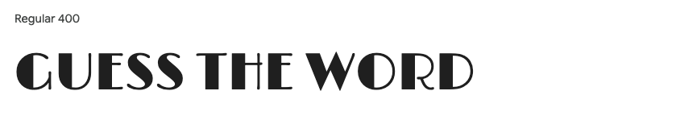
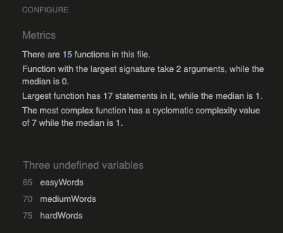
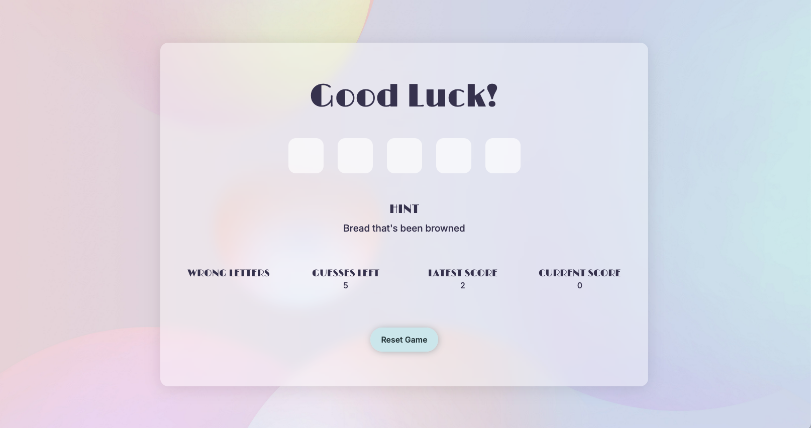
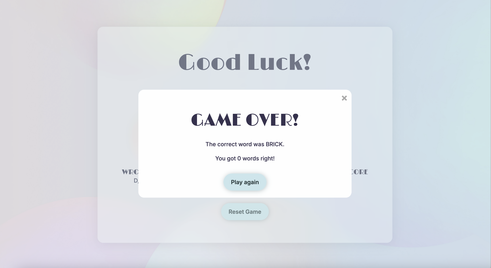
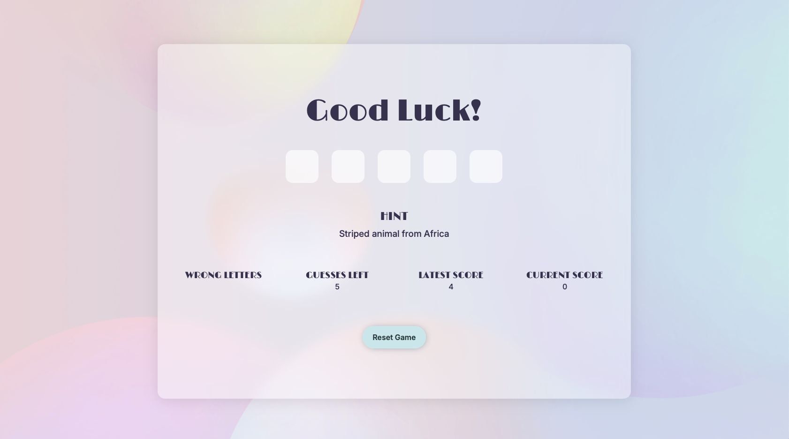
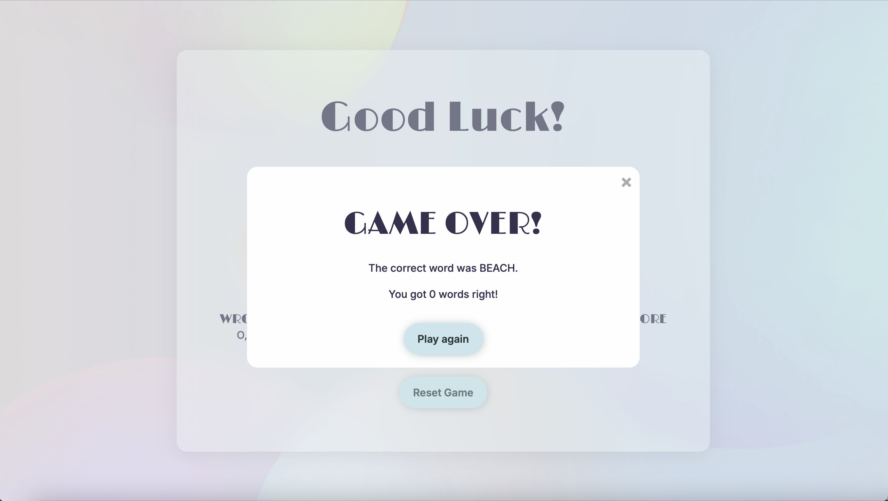
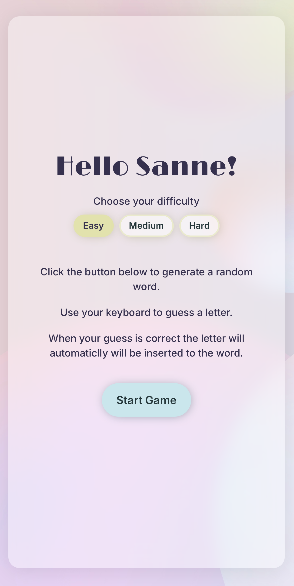
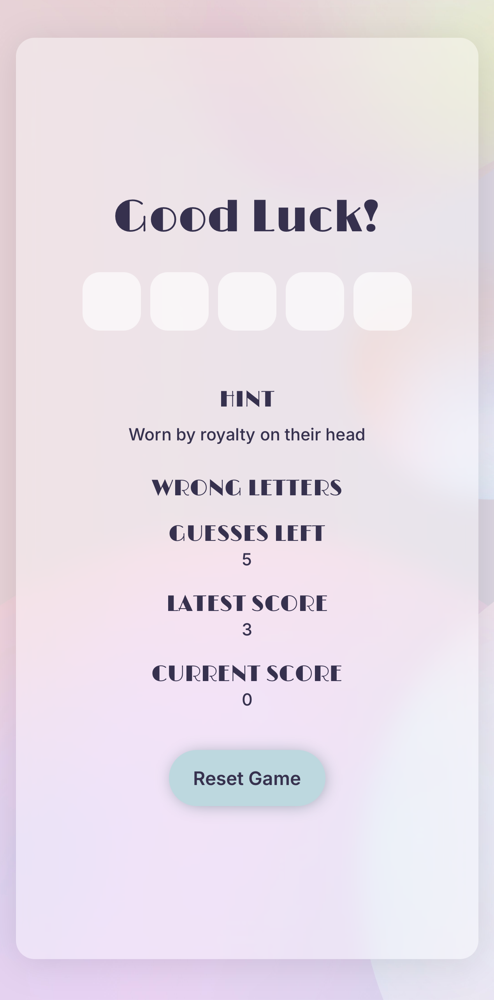

# Guess the Word

 

Guess the Word is my second Milestone Project created for Code Institute Level 5 Diploma in Web Application Development. 

Link to deployed site: [Guess the Word](https://ssannejohansson.github.io/MP2-guess-the-word/)

## User Experience (UX)

### Project Goals / Rationale

#### Key information for the site
- A word guessing game
- Input field for personal greeting
- Possibility to choose from three different difficulty levels
- Hints for every word
- Feedback after game over

### User Stories

#### First time visitor goals
- I want to play a word guessing game
- I want instructions for the game

#### Returning visitor goals
- I want to be able to choose a different difficulty
- I want to know how many words I guessed right

#### Frequent visitor goals
- I want to see if I can beat my last score

### Client Goals and Moscow Prioritization

#### Must Have
- A responsive website that looks and functions well on all screensizes 
- JavaScript for interactivity
- Clean, focused design 
- Search Engine Optimization (SEO)
- A list of wrong letters
- Possibility to restart the game

#### Should Have
- A modal that communicates when the game is over
- Different difficulty levels
- Random, shuffeled words 
- Score count

#### Could Have
- A personal greeting

## Design

### Color Scheme
For color scheme, I took inspiration from the background image to generate a scheme that looked good. For this, I used [Muzli Colors](https://colors.muz.li/). 

### Typography

I used Google Fonts for the typography.

For headings, I used [Limelight](https://fonts.google.com/specimen/Limelight?query=limelight). I choose this font because of it's simple but yet playful look. 

For paragraphs, I used [Inter Medium](https://fonts.google.com/specimen/Inter?query=inter) since I wanted the font weight to match the Limelight font, yet be easy to read. 

### Imagery

The background are downloaded from [Unsplash](https://unsplash.com/). Please see the credits section for attribution. 

### Wireframes

Wireframes are created using [Balsamiq](https://balsamiq.com/). 

Mobile

Tablet

Desktop

### Features 
**Favicon**  
The favicon is created using [Favicon.io](https://favicon.io/favicon-converter/), using the same background color as the buttons.  

**Buttons**  
Buttons are bootstrap-buttons with custom styling to match the website.  

 
Custom button and custom button on hover  

 
Difficulty buttons and difficulty buttons on hover / while selected.

**Letterbox**  
Letterboxes with different looks depending on state.  

  
Empty / Guessed letter / Right word / Game over

**Modal**  
Modal that shows when number of guesses run out and game is over.

### Future implementations
- In the future, I will add functionality to store latest score. 

## Technologies Used

### Languages Used
HTML, CSS and JavaScript. 

### Frameworks and Libraries Used
[Bootstrap](https://getbootstrap.com) - CSS Framework. 

[jQuery](https://jquery.com/) - JavaScript Library.

### Programs Used
[Balsamiq](https://balsamiq.com/) - Used to create Wireframes. 

[Git](https://git-scm.com/) - For version conrol. 

[Github](https://github.com/) - To store the site online and deploy the website. 

[Favicon.io](https://favicon.io/favicon-converter/) - To create favicon. 

[Google Fonts](https://fonts.google.com/) - To import the fonts used on the website. 

[Unsplash](https://unsplash.com/) - For background image. 

[Color Palette Generator](https://colors.muz.li/) - To generate color palette from image.

[Contrast Checker](https://coolors.co/contrast-checker/112a46-acc8e5) - To check contrast between background and text on website. 

[Autoprefixer](https://autoprefixer.github.io/) - To make sure the code is working across browsers. 

[Am I Responsive?](https://ui.dev/amiresponsive) - To show the website on all devices.

## Deployment & Local Development
### Deployment
I've used GitHub Pages to deploy this site. To deploy a site on GitHub Pages you'll need to  
1. Go to your project repository on GitHub.
2. Click on **Settings** in the navigation. 
3. Click on **Pages** in the left section. 
4. Choose what branch to deploy at the **Source** dropdown. 
5. Choose which folder you want to deploy.
6. Click Save and wait a few minutes for the site to deploy. 
7. When the site is deployed, you can find it under **Deployments** in the right section of your repository page. 

### Local Development 
**How to Fork**

To fork the repository, log in to your GitHub account, go to the repository of the project you want to fork [this one](https://github.com/ssannejohansson/MP2-guess-the-word) for this project, and click on the Fork button in the top right corner. 

**How to Clone**

To clone the repository, log in your GitHub accout, go to the repository of the project you want to clone [this one](https://github.com/ssannejohansson/MP2-guess-the-word.git) for this project, click on the **Code** button and select if you want to clone with HTTPS, SSH or GitHub CLI and copy the code. Open the **terminal** in your code editor and change directory to the location you want to use for the cloned directory and type *git clone* into the terminal and paste the link you copied. Press **enter**. 

## Testing

### W3C Validator and JSHint
I used [W3C Markup Validator](https://validator.w3.org/), [W3C CSS Validator](https://jigsaw.w3.org/css-validator/) and [JS Hint](https://jshint.com/) to validate the HTML, CSS and JavaScript. 
- **HTML** - No errors.  

- **CSS** - No errors. Warnings about variables and about vendor extensions coming from autoprefixes when I run the code through [Autoprefixer](https://autoprefixer.github.io/).  

- **JavaScript** - No errors. One unused variable, this is because diffPage is called on click at index.html and not in script.js.  

### Lighthouse
I used the Chrome Developer Tool Lighthouse to test performance, accessibility, best practices and SEO of the website. I run the test for both desktop and mobile. 

**Desktop**

**Mobile** 

Orange performance on mobile are explained by the usage of Bootstrap framework and jQuery library. 

### Browser Compatibility

| Browser | Start Page | Difficulty Page | Game page | Modal | 404 | Notes |
| -------- | ------- | -------- | ------- | -------- | ------- | -------- |  
| Chrome |  | |  |   |  | Work as expected | 
| Firefox |  |  |  |  |  | Work as expected | 
| Edge |  |  |  |  |  | Work as expected | 
| Safari |  |  |  |   |  | Work as expected | 

### Responsiveness

| Device | Start Page | Difficulty Page | Game Page | Modal | 404 | Notes |
| -------- | ------- | -------- | ------- | -------- | -------- | -------- | 
| Mobile (DevTools) |  |  |  |  |  | Work as expected | 
| Iphone 16 Pro Max | | |  |  |  | Work as expected | 
| Tablet (DevTools) | |  |  |  |  |  | Work as expected | 
| 13.6 inch MacBook Air M2  | | |  |  |  | Work as expected | 
| Desktop L (Devtools) |  | |  |  |  |  Work as expected | 

### Testing Client Goals
| Moscow Prioritization | Goal | Status |
| --- | ----------- | --- |
| **Must Have** | A responsive website that looks and functions well on all screensizes | **Done**|
| **Must Have** | JavaScript for interactivity | **Done** |
| **Must Have** | Clean, focused design | **Done** |
| **Must Have** | Search Engine Optimization (SEO). | **Done** |
| **Must Have** | A list showing wrong letter| **Done** |
| **Must Have** | Possibility to restart game | **Done** |
| **Should Have** | A modal with feedback | **Done** |
| **Should Have** | Different difficulty levels | **Done** |
| **Should Have** | Random, shuffeled words | **Done** |
| **Could Have** | A personal greeting | **Done** |

### Testing Feautures
| Page | Feature | Expected Outcome | Action | Pass / Fail |
| ----------- | ----------- | ----------- | ----------- | ----------- | 
| Start | **Input field** | When clicked, input works | Clicked the field, wrote name | Pass | 
| Start | **Continue button** | When clicked, the page will return to difficulty page | Clicked the button | Pass | 
| Difficulty | **Personal Greeting** | The name input from previous page shows | Looked at it | Pass |
| Difficulty | **Difficulty buttons** | When clicked, the respective button will turn active | Clicked the buttons | Pass |
| Difficulty | **Start game button** | When clicked, the page will return to game page | Clicked the button | Pass |
| Game | **Letterbox** | When pressing key, the key shows in letterbox | Pressed key | Pass |
| Game | **Letterbox** | When clicked, input works | Clicked the field, wrote letter | Pass |
| Game | **Hints** | A hint that matches the word shows | Compared hint and word | Pass |
| Game | **Wrong letters** | When wrong letter is written it shows under wrong letters | Wrote wrong letter | Pass |
| Game | **Guesses lefts** | When wrong letter is written, guesses decreases by one | Wrote wrong letter| Pass |
| Game | **Score** | When right letter is written, score will increment | Wrote the right word | Pass |
| Game | **Right word** | When right word is written, letters will turn green | Wrote the right word | Pass |
| Game | **Right word** | When right word is written, a new word and hint will show | Wrote the right word | Pass |
| Game | **Wrong word** | When wrong word is written and guesses reach 0, letters will turn red and the right word shows | Wrote the wrong word | Pass |
| Modal | **Game over** | When wrong word is written and guesses reach 0, a modal pops up | Wrote the wrong word | Pass |
| Modal | **Game over** | The right feedback shows in modal | Played the game and checked modal | Pass |
| Modal | **X button** | When clicked, the modal will close | Clicked the X | Pass |
| Modal | **Play again button** | When clicked, the score and guesses left will reset and a new word show | Clicked the button | Pass |
| 404 | **Return to homepage** | When clicked, home page will open | Clicked button | Pass |
| All | **Hovers** | When hover, all buttons  will have a hover effect to show that they are focused | Hovered the buttons | Pass |

### Bugs

#### Solved bugs

| Bug | How I solved it |
| ----------- | ----------- |
| It didn't work to filter the wordList array to get different difficulty levels based on word length | Instead of filtering, I created separate arrays for each difficulty level and pushed the specific array into the wordList array | 
| Score count got resetted with each new word | Since I had the score variable set to 0 inside of the random word function, it got resetted to 0 because the function was called every time a correct word was found | 
| The letter "W" got cut off in letterbox on mobile | Set padding to 0 to remove the default input padding that cut the letter off.| 
| Words got repeated before the whole wordlist was used up | I tried at least 15 different solutions but none of them worked with the rest of my code, so I took to chatGPT for help with my specific code. The solution, that actually worked (yay!) was to shuffle the wordList array and assign each item a random number, and then sort the array by number, and then return a new array with the random, sorted, words. When the whole list is used, it restarts. 

## Credits
  
### Code Used
[CSS Generator Tool](https://cssgenerator.org/) - For generating box-shadow.

[CSS Glass Container](https://css.glass/) For generating glass container. 

[Coding Nepal](https://www.codingnepalweb.com/word-guessing-game-html-css-javascript/#goog_rewarded) - Tutorial for creating word guessing game. 

[@SharathchandarK](https://www.youtube.com/watch?v=JYVycJ2CXiI) - Tutorial for creating word guessing game. 

[Stack Overflow](https://stackoverflow.com/questions/64712803/change-game-difficulty-javascript) - The user Marc's solution for changing difficulty. 

[w3scools](https://www.w3schools.com/howto/howto_css_modals.asp) - Guide to create a modal.

[David Chedrick](https://dev.to/davidchedrick/creating-a-simple-timer-and-score-keeper-in-javascript-394g) - Tutorial for score-keeping.

[Jeff Starr](https://wp-mix.com/jquery-reload-current-page-click/) - Guide to create function for refreshing page on click.

[ChatGPT](https://chatgpt.com/?openaicom) - Solution for avoiding the same word twice in one round. 

### Content
The words and hints are generated by [ChatGPT](https://chatgpt.com/?openaicom_referred=true).

### Media
[Background](https://unsplash.com/photos/background-pattern-UJlbhSnptTE) - Christina Deravedisian.

